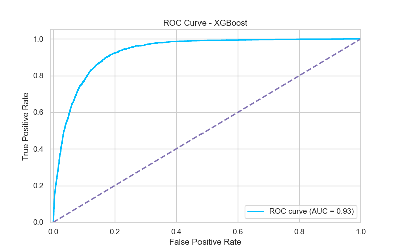

# Data-Driven Predictions for Term Deposit Subscriptions

## Business Motivation

This project focuses on improving the effectiveness of bank marketing campaigns by predicting which customers are most likely to subscribe to a term deposit after a marketing call. Using machine learning, we aim to help banks target the right audience, reduce wasted efforts, and boost conversion rates. By accurately predicting customer responses, banks can allocate resources more efficiently, tailor campaigns to individual customers, and ultimately increase marketing success. Additionally, the model can provide insights into the key factors influencing customer decisions, helping shape more effective strategies for future campaigns.

## Data

The [Bank Marketing Dataset](https://archive.ics.uci.edu/dataset/222/bank+marketing) contains data from direct marketing campaigns carried out by a Portuguese banking institution. These campaigns primarily involved contacting customers through phone calls to promote term deposits. The dataset is designed to predict whether a customer will subscribe to a term deposit after the call, which is represented as a binary classification problem (`yes` or `no`).

The dataset consists of 20 attributes, including both categorical and numerical features that capture customer demographics, socio-economic conditions, and details of the marketing campaign itself. Below is an overview of some key attributes:

| Attribute | Description |
|-----------|-------------|
| age       | Age of the customer |
| job       | Type of job the customer holds (e.g., admin., blue-collar, technician) |
| marital   | Customer's marital status (single, married, divorced) |
| education | Level of education of the customer |
| default   | Indicates whether the customer has credit in default (yes or no) |
| balance   | The average yearly balance of the customer’s account (in euros) |
| housing   | Indicates whether the customer has a housing loan (yes or no) |
| loan      | Indicates whether the customer has a personal loan (yes or no) |
| contact   | Indicates whether the customer has a personal loan (yes or no) |
| day       | Last contact day of the month |
| month     | Last contact month of the year |
| duration  | Duration of the last call (in seconds) |
| campaign  | Number of contacts performed during this campaign for this client |
| pdays     | Number of days since the client was last contacted from a previous campaign |
| previous  | Number of contacts performed before this campaign |
| poutcome  | Outcome of the previous marketing campaign (e.g., success, failure) |
| y         | The target variable indicating whether the client subscribed to a term deposit (yes or no) |

## Model Evaluation

In this project, we explored different models for binary classification to predict whether a customer would subscribe to a term deposit following a marketing call. The models we evaluated included Logistic Regression, Random Forests, Gradient Boosting, XGBoost, and Neural Networks. We started by splitting the data into training and test sets, and then used Bayesian Optimisation to fine-tune the hyperparameters, ensuring that each model was optimised for performance.

Due to the imbalanced nature of the dataset, we prioritised the ROC-AUC score as the main metric for evaluating model effectiveness, while also using confusion matrices to gain additional insights. In addition to ROC-AUC, we assessed other performance metrics such as accuracy, precision, recall, and F1 scores. We also considered factors like data complexity, model interpretability, and computational resources during model selection. 

Based on our evaluation, XGBoost emerged as the best-performing model for predicting customer subscriptions. It provided a good balance between predictive accuracy and practical considerations such as interpretability. While no model delivered perfect predictions, XGBoost performed well across key metrics and offered the best trade-off between precision, recall, and ROC-AUC, making it well-suited for handling the imbalanced nature of the dataset. 

Below are the performance results of the XGBoost classifier on the test set:

| Algorithm | ROC-AUC | Accuracy | Precision | Recall | F1 Score
|-----------|-----------|-----------|-----------|-----------|-----------|
| XGBoost | 0.8553 | 0.8656 | 0.9156 | 0.8656 | 0.8813 

## Hyperparameter Tuning
Description of which hyperparameters you have and how you chose to optimise them. 

## Results

## Actionable Insights

The top contributing features — balance, duration and age — highlight that customer financial stability, campaign engagement, and demographics are critical in determining subscription likelihood. Our analysis reveals key insights that can help the marketing team develop strategies to boost subscription rates for the bank's term deposit campaign.

| Feature | Recommendation | Explanation |
| --- | --- | --- |
| Balance | Target high-balance customers | With balance being a key predictor of term deposit subscriptions, the marketing team should focus on customers with higher account balances. Personalised offers or incentives for these customers could boost conversions, as they likely have the financial stability to invest and are prime candidates for the campaign. |
| Duration | Enhance interaction quality | The duration of conversations strongly influences customer decisions. The marketing team should train agents to engage in longer, more meaningful discussions that highlight the benefits of the term deposit and address customer needs. Focusing on quality over quantity of calls can significantly improve results. |
| Contact method | Prioritise direct and personal communication | Customers contacted via cellular channels are more likely to respond positively, suggesting that direct and personal communication works better than more passive methods. |
| Timing | Release campaigns on high-conversion dates | Certain months, like May, and specific days of the week have higher conversion rates, highlighting the importance of campaign timing. The marketing team should focus on these optimal periods and use direct communication methods to boost success rates. |
| Age | Leverage customer demographics | The model shows age as a key factor, with older customers slightly more likely to subscribe. Marketing efforts should be segmented by age group, using tailored messaging. Older customers may prefer safe, long-term investments like term deposits, while younger customers may need extra incentives. |

By aligning campaign strategies with data analysis and model insights, the marketing team can better allocate resources, enhance customer engagement, and ultimately increase subscription rates for the bank's term deposit offerings.
